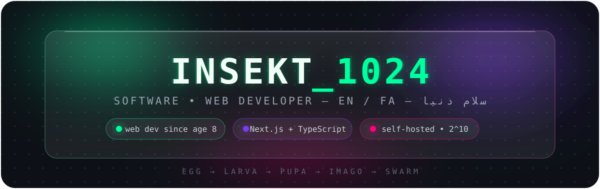
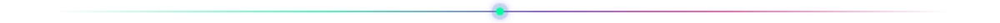
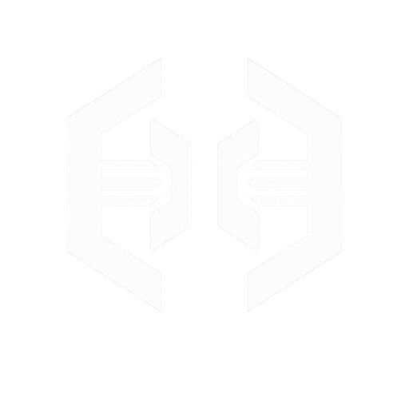
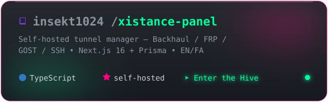

<!--- insekt1024 · glass-hive · tokyonight #0D1117 / #00FF9D / #7C3AED / #FF007F -->



<p align="center">
  
</p>

<p align="center">
  
  
  
</p>

<p align="center"><a href="#-about">About</a> • <a href="#-stack">Stack</a> • <a href="#-featured">Project</a> • <a href="#-stats">Stats</a> • <a href="#-connect">Connect</a></p>



<p align="center"></p>

## 🧬 About

```typescript
const insekt = {
  role: "Software & Web Developer",
  origin: "HTML + CSS @ age 8-9",
  credo: "Ship self-hosted. Own your infra.",
  now: "Xistance Panel v1.x // EN + FA + RTL",
}; // 1024 = 2^10 🪲
```

<p align="center">
  <br/>
  <sub><i>EGG → LARVA → PUPA → <b>IMAGO</b> → SWARM — small like an insect, persistent like one too.</i></sub>
</p>


<p align="center"></p>

## 🧰 Stack

<p align="center">
  
  <br/><sub>Backhaul • FRP • GOST • SSH • systemd • Nginx • UFW</sub>
</p>


<p align="center"></p>

## 🚀 Featured

<p align="center"><b><a href="https://github.com/insekt1024/xistance-panel">Xistance Panel</a></b> — self-hosted tunnel manager (Backhaul / FRP / GOST / SSH), Next.js 16 + Prisma, EN/FA.</p>

<p align="center">
  <a href="https://github.com/insekt1024/xistance-panel"></a>
</p>

<p align="center">
  <a href="https://github.com/insekt1024/xistance-panel"></a><br/>
  
  
</p>

| Module | What it does |
|---|---|
| Tunnels | Backhaul, FRP, GOST, SSH — TCP/UDP, Iran / Foreign roles |
| Nodes + Engine | Remote installer, traffic/status, systemd `xt-tunnel-*` |
| UI | EN + FA RTL, live logs, backup/restore, CLI bridge |

<p align="center"><a href="https://github.com/insekt1024/xistance-panel"><b>➤ Enter the Hive</b></a> <sub>• <code>npm run dev</code> → :3000</sub></p>


<p align="center"></p>

## 📊 Stats

<p align="center">
  <br/>
  
</p>

<details>
<summary><b>🔥 streak</b></summary>
<p align="center">
  
</p>
</details>

<p align="center"><a href="https://github.com/insekt1024"></a></p>


<p align="center"></p>

## 🧠 Now

- 🔨 Xistance → stable v1.0 + one-click node installer
- 📚 Next.js 16 RSC • Prisma + Postgres • Docker hardening
- 🎯 2026: 100★ on Xistance, 3 OSS packages


<p align="center"></p>

## 📡 Connect

<p align="center">
  <a href="https://github.com/insekt1024"></a>
  <a href="https://t.me/insekt1024"></a>
  <a href="https://github.com/insekt1024/xistance-panel"></a>
</p>

<p align="center"></p>


<!-- Snake: Settings → Actions → Read+write, add snake.yml (Platane/snk svg-only, user insekt1024) → branch `output`. -->
<!-- Local glass assets live in ./assets (hero, divider, pills, footer) — pushed with this repo. -->
